# Sudoku Solver Project Guide

## Image Standardization

All digit images from different datasets are normalized through a shared preprocessing function so that the model receives a consistent input format.

### Preprocessing Steps

The shared preprocessing pipeline performs the following operations:

- convert the image to grayscale
- apply thresholding
- ensure the digit appears as black on a white background
- find the digit bounding box
- crop the digit region
- place the digit at the center of a square canvas
- resize the final image to `32 x 32`

### Output Format

The final standardized digit image has:

- grayscale format
- fixed resolution of `32 x 32`
- black digit on a white background

This standardization is necessary because the project combines multiple datasets with different visual styles, image sizes, and background conditions.

 

## Training Pipeline

The training system is implemented in PyTorch and uses a CNN model named `SudokuCNN`.

### Training Configuration

Key settings include:

- training path: `dataset/train`
- test path: `dataset/test`
- number of classes: `19`
- image size: `32`
- batch size: `256`
- epochs: `50`
- optimizer: `AdamW`
- learning rate: `1e-3`
- weight decay: `1e-4`
- scheduler: `ReduceLROnPlateau`
- early stopping patience: `8`

### Data Augmentation

The training set uses the following transformations:

- grayscale conversion
- resize to `32 x 32`
- random rotation
- random affine translation and scaling
- tensor conversion

The evaluation/test pipeline uses lighter preprocessing:

- grayscale conversion
- tensor conversion

### Training Features

The training script includes:

- GPU detection
- mixed precision training with AMP
- checkpoint saving
- CSV logging
- TensorBoard logging
- validation after each epoch
- best-model saving
- early stopping

### Saved Outputs

The training process saves:

- `weights/best_model.pth`
- `training_log.csv`
- TensorBoard logs in `runs/sudoku_cnn`

 

## Sanity Check Script

A separate sanity-check step is used to verify that:

- dataset loading works correctly
- image and label shapes are correct
- the model can perform a forward pass
- output shape matches the expected number of classes
- parameter counts can be inspected

This helps confirm that the dataset pipeline and model definition are correctly connected before full training begins.

 

## Evaluation Pipeline

The project includes an evaluation script for testing the trained model on the test dataset.

### Evaluation Process

The evaluation script:

- loads the trained checkpoint
- runs inference on all test images
- collects ground-truth and predicted labels
- computes a classification report
- computes a confusion matrix
- calculates total accuracy
- saves misclassified images for manual inspection

### Evaluation Outputs

Saved outputs include:

- `output/classification_report.txt`
- `output/confusion_matrix.png`
- misclassified images in `output/misclassified/`

Each misclassified image is saved with a filename that includes:

- sample index
- true label
- predicted label

### Confusion Matrix Visualization

The confusion matrix is visualized in a customized way:

- diagonal cells are shown in blue to highlight correct predictions
- off-diagonal cells are shown in red to highlight classification errors
- each cell is annotated with its raw count

This makes it easier to distinguish correct predictions from class confusions during analysis.

 

## Sudoku Image Processing Pipeline

The Sudoku recognition stage uses a multi-step computer vision pipeline.

### 1. Image Preprocessing

The input image is first prepared using:

- grayscale conversion
- Gaussian blur
- thresholding
- morphological cleanup

Intermediate images may also be saved for debugging.

### 2. Grid Detection

The board is detected by locating the outer Sudoku contour from the thresholded image.

This stage:

- finds contours
- selects the most likely board contour
- returns the corner points of the Sudoku grid

### 3. Perspective Transformation

After the board corners are found:

- the original image is warped
- the grayscale image is warped
- a square, top-down board view is produced

This removes perspective distortion and prepares the board for cell-level processing.

### 4. Grid-Line Removal

In the command-line inference pipeline, grid lines are removed using `remove_grid_lsd` before digit recognition.

This helps reduce interference from horizontal and vertical grid lines that may overlap the handwritten digits.

Note that the Streamlit interface currently warps and splits the grayscale board directly, while the standalone inference script explicitly applies grid-line removal.

### 5. Cell Splitting

The processed Sudoku board is divided into a `9 x 9` matrix of cells.

These cells can also be saved individually for debugging and inspection.

 

## Digit Recognition Pipeline

Digit recognition is handled by the `Predictor` class.

### Predictor Responsibilities

The predictor:

- loads the trained `SudokuCNN` model
- preprocesses a single Sudoku cell
- extracts the digit region from the cell
- ignores empty or very small noisy regions
- performs neural network inference
- returns:
  - predicted digit
  - confidence score
  - probability distribution over all 19 classes

### Internal Cell Preprocessing

Before classification, the predictor:

- converts the cell to grayscale if needed
- extracts the digit using `extract_digit`
- rejects empty cells
- rejects very small regions likely to be noise
- standardizes the digit using the shared preprocessing function
- normalizes pixel values to the range `[0, 1]`
- converts the result to a tensor of shape suitable for the CNN

If no valid digit is found, the predictor returns class `0` with confidence `1.0`.

### Class-to-Digit Mapping

The classifier predicts one of 19 classes:

- `0` for empty cells
- `1` to `9` for English digits
- `10` to `18` for Persian digits

During inference, Persian classes are mapped back to Sudoku digits as follows:

- class `10` becomes digit `1`
- class `11` becomes digit `2`
- ...
- class `18` becomes digit `9`

This ensures that both English and Persian digit styles produce a valid numeric Sudoku grid.

### Board Language Detection

A special post-processing stage is used to detect the dominant digit language of the board.

The predictor estimates whether the board is primarily:

- English
- Farsi

This decision is made by analyzing the predicted probability distributions across all cells.

### Language-Corrected Prediction

After board language detection, the system performs language-aware correction:

- if a cell prediction already matches the board language, it is kept
- if the predicted class belongs to the other language, the corresponding same-value class in the detected board language is considered
- the final digit is selected using this correction rule

This improves consistency when the board contains digits of a single writing system but the classifier occasionally confuses English and Persian versions of the same number.

 

## Full Sudoku Inference Workflow

The main Sudoku inference pipeline performs the following steps:

1. check that the input image exists
2. check that model weights exist
3. create output folders
4. load the predictor
5. read the input image
6. save the original image
7. preprocess the image
8. detect the grid
9. warp the board
10. optionally remove grid lines
11. split the board into 81 cells
12. save each cell for debugging
13. predict the digit and probability distribution for every cell
14. detect the dominant board language
15. apply language-corrected predictions
16. reconstruct the Sudoku matrix
17. validate the board
18. solve the puzzle if valid
19. print or display the solved grid

This produces a complete image-to-solution pipeline.

 

## Streamlit User Interface

In addition to the command-line inference script, the project includes a Streamlit-based graphical interface.

### Streamlit Features

The interface allows the user to:

- upload a Sudoku image in `PNG`, `JPG`, or `JPEG` format
- view the input image
- view the extracted warped board
- inspect thresholding results
- inspect all 81 extracted cells
- run digit recognition interactively
- display the initial detected matrix
- display the language-corrected matrix
- solve the Sudoku if the board is valid

### Performance Optimization

The Streamlit app uses cached model loading so that the predictor is initialized only once.

This reduces repeated loading time and makes the application more responsive.

### Error Handling

The interface also handles common issues such as:

- missing model weights
- invalid uploaded images
- recognition or processing failures
- inconsistent Sudoku grids

 

## Sudoku Solver

The Sudoku solver is implemented using recursive backtracking.

### Core Functions

#### `is_valid(board, row, col, num)`

Checks whether a number can be placed in a location by verifying:

- row constraints
- column constraints
- `3 x 3` box constraints

#### `find_empty(board)`

Finds the next empty cell, represented by `0`.

#### `solve_sudoku(board)`

Recursively tries values from `1` to `9` until the puzzle is solved or no solution exists.

#### `is_board_valid(board)`

Validates the detected Sudoku board before solving by checking for duplicate conflicts in rows, columns, and sub-grids.

This step is important because OCR mistakes can generate invalid Sudoku boards.

 

## Debugging and Analysis Support

The project includes several debugging and inspection features.

### Saved Intermediate Outputs

Depending on the script and debug mode, the system may save:

- original input image
- grayscale image
- blurred image
- thresholded image
- warped color board
- warped grayscale board
- board after grid-line removal
- extracted cells
- extracted raw digits
- processed digit images
- sample prediction inputs

### Misclassification Logging

During evaluation, incorrect predictions are saved as image files for manual review.

### Cell-Level Logging

During full inference, the script prints per-cell predictions with confidence values, which helps identify weak recognitions and problematic regions.

 

## Project Pipeline Summary

The complete pipeline of the project can be summarized as follows:

1. collect samples from MNIST, HODA, and Chars74K
2. generate synthetic empty-cell samples
3. standardize all images into `32 x 32` grayscale format
4. save the dataset in `ImageFolder` structure
5. train the `SudokuCNN` classifier on 19 classes
6. evaluate the trained model and save reports
7. read a Sudoku image during inference
8. preprocess the image and detect the board
9. warp the board into a square top-down view
10. optionally remove grid lines
11. split the board into 81 cells
12. classify each cell and collect probability distributions
13. detect the dominant board language
14. apply language-aware prediction correction
15. reconstruct the Sudoku matrix
16. validate the board
17. solve it using backtracking
18. display or save the final result and debugging outputs

 

## How to Run the Project

The project can be executed end to end with the following workflow.

### 1. Prepare the Dataset
```bash
python convert_dataset.py
```
This creates the training and test folders under [dataset](dataset) with class subfolders such as `00` to `18`.

### 2. Run the Sanity Check
```bash
python sanity_check.py
```
This verifies dataset loading, image and label shapes, model forward pass behavior, and output dimensions.

### 3. Train the Model
```bash
python train.py
```
This trains the CNN classifier, validates after each epoch, and saves the best checkpoint to [weights/best_model.pth](weights/best_model.pth).

### 4. Evaluate the Trained Model
```bash
python evaluate.py
```
This generates the evaluation report and confusion matrix artifacts in [reportpics](reportpics):
- [reportpics/classification_report.txt](reportpics/classification_report.txt)
- [reportpics/confusion_matrix.png](reportpics/confusion_matrix.png)
- misclassified examples in [reportpics/misclassified](reportpics/misclassified)

### 5. Run Full Sudoku Inference
```bash
python main.py
```
This script reads the sample Sudoku image at [images/sudoku.png](images/sudoku.png), preprocesses it, detects the board, removes grid lines, splits the board into cells, predicts digits, detects the board language, corrects language-specific errors, validates the board, and solves it if possible.

### 6. Run the Streamlit Application
```bash
streamlit run app.py
```
This launches a web interface for interactive Sudoku image upload, recognition, and solving.

### 7. Inspect Dataset Structure if Needed
```bash
python test_chars74k.py
```

## Example Run Report from main.py

A sample end-to-end inference run is documented below using the tracked report assets in [reportpics](reportpics). Running [main.py](main.py) produces the following outputs:

### Processing pipeline outputs

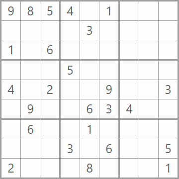

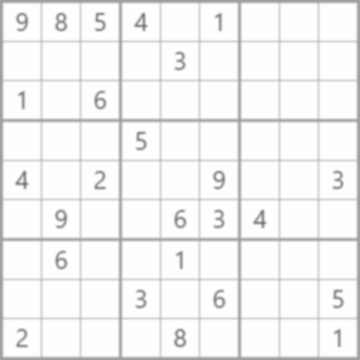
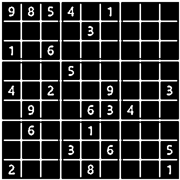

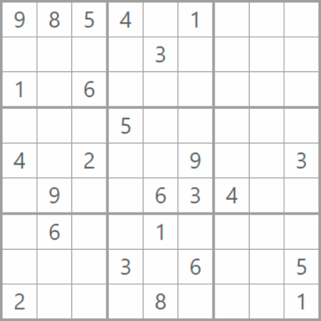

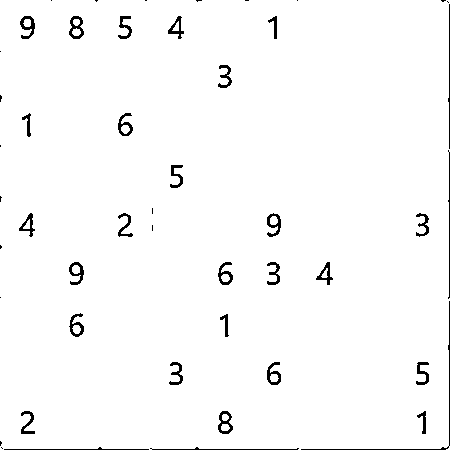


### Evaluation outputs

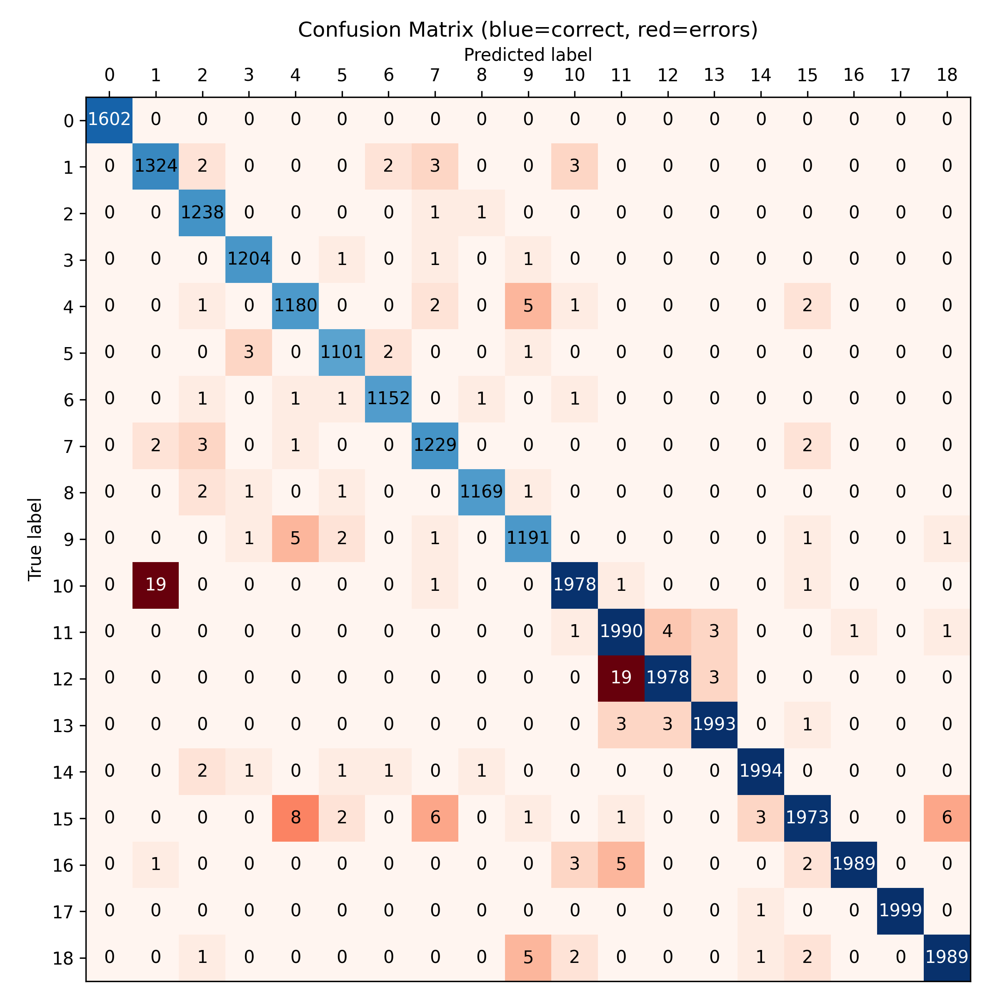
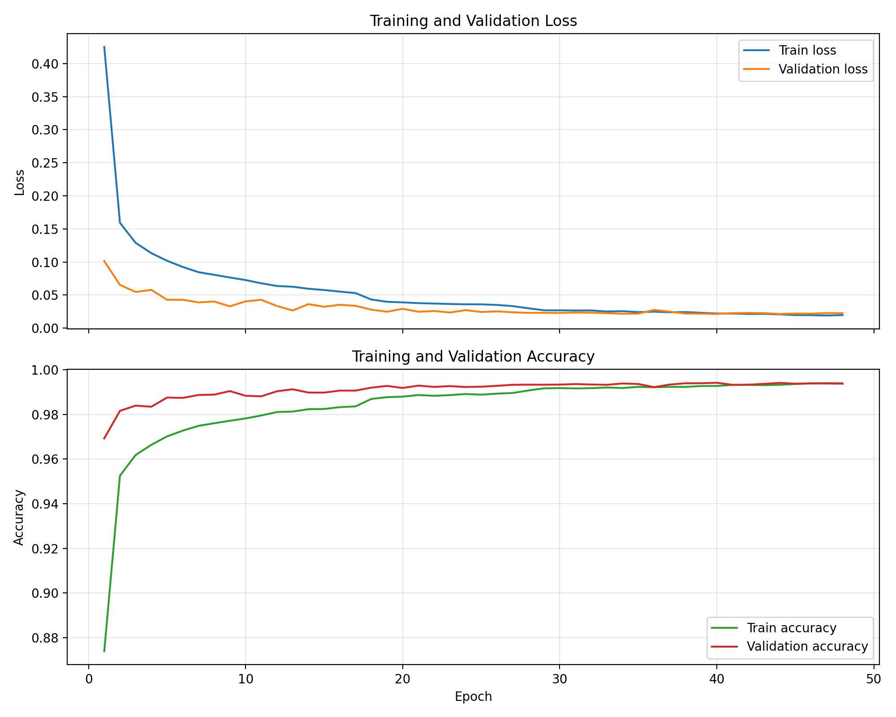

Representative extracted cells and misclassified samples are available in [reportpics/cells](reportpics/cells) and [reportpics/misclassified](reportpics/misclassified). The full 9×9 cell grid is shown below using the extracted-cell images from [output/cells](output/cells):

<div align="center">

| Row 1 | Row 2 | Row 3 |
|---|---|---|
| 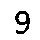 | 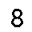 | 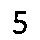 |
|  |  |  |
|  |  |  |

| Row 4 | Row 5 | Row 6 |
|---|---|---|
|  |  |  |
| 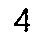 |  | 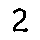 |
|  | 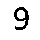 |  |

| Row 7 | Row 8 | Row 9 |
|---|---|---|
|  | 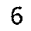 |  |
|  |  |  |
| 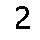 |  |  |

</div>

The sample run produced the following detected grid:

```text
9 8 5 4 0 1 0 0 0
0 0 0 0 3 0 0 0 0
1 0 6 0 0 0 0 0 0
0 0 0 5 0 0 0 0 0
4 0 2 0 0 9 0 0 3
0 9 0 0 6 3 4 0 0
0 6 0 0 1 0 0 0 0
0 0 0 3 0 6 0 0 5
2 0 0 0 8 0 0 0 1
```

After solving, the pipeline recovered the completed Sudoku grid:

```text
9 8 5 4 2 1 7 3 6
7 2 4 6 3 8 5 1 9
1 3 6 9 5 7 8 4 2
6 7 3 5 4 2 1 9 8
4 1 2 8 7 9 6 5 3
5 9 8 1 6 3 4 2 7
3 6 7 2 1 5 9 8 4
8 4 1 3 9 6 2 7 5
2 5 9 7 8 4 3 6 1
```

The inference run also reported the detected board language as English.

## Evaluation Report from evaluate.py

The evaluation script produces a quantitative report for the trained classifier.

### Latest measured results

- Accuracy: 99.42%
- Macro average F1-score: 0.9940
- Weighted average F1-score: 0.9942

The full report is stored in [reportpics/classification_report.txt](reportpics/classification_report.txt), and the visual confusion matrix is saved as [reportpics/confusion_matrix.png](reportpics/confusion_matrix.png). Misclassified samples are also stored in [reportpics/misclassified](reportpics/misclassified) for manual review.

## Project Directory Structure

Key folders and files in the repository include:

- [dataset](dataset) for the prepared train and test images
- [weights](weights) for the trained model checkpoint
- [output](output) for inference and evaluation artifacts
- [runs](runs) for TensorBoard event logs
- [image_processing](image_processing) for the computer-vision preprocessing modules
- [inference](inference) for the predictor and prediction logic

## Strengths of the Project
* **Complete End-to-End Pipeline:** Full Sudoku OCR and solving flow.
* **Bi-lingual Support:** Supports both English and Persian handwritten digits.
* **Language-Aware Prediction:** Includes language-aware prediction correction.
* **Dataset Diversity:** Combines multiple datasets (MNIST, HODA, Chars74K) for better visual diversity.
* **Synthetic Empty-Cell Generation:** Includes generation of empty cells for training stability.
* **Dual Interfaces:** Provides both CLI and interactive Streamlit web interfaces.
* **Evaluation Reports:** Saves comprehensive evaluation reports and misclassified samples.
* **Validation Check:** Includes validation before attempting to solve the Sudoku.
* **Modular Design:** Clearly separates preprocessing, inference, and solving logic.

 

## Challenges and Limitations

### 1. Separate Classes for the Same Numeric Digits
English and Persian digits are treated as different visual classes:
* **English:** Classes `1` to `9` (mapped to `01`-`09`)
* **Persian:** Classes `1` to `9` (mapped to `10`-`18`)

Although language correction improves consistency, the model still learns two separate representations for the same numeric Sudoku values.

### 2. Sensitivity to Input Quality
Performance may decrease when:
* Lighting is poor
* The image is blurred
* Perspective distortion is severe
* Digits are faint
* The board is partially occluded
* Grid lines overlap digit strokes

### 3. Dependence on Cell Extraction Quality
Recognition accuracy strongly depends on correct board detection, warping, digit extraction, and cell quality.

### 4. Inconsistency Between Interfaces
The standalone inference script explicitly removes grid lines, while the Streamlit app currently processes the warped grayscale board directly. This may lead to slightly different recognition behavior across interfaces.

 

## Appendix: Important Modules and Scripts

### `app.py`
Provides a Streamlit interface for interactive Sudoku image upload, board extraction, digit recognition, language correction, and solving.

### `evaluate.py`
Evaluates the trained model, computes metrics, saves misclassified images, and generates a custom confusion matrix visualization.

### `inference/predictor.py`
Handles model loading, digit extraction, preprocessing, class-to-digit mapping, board language detection, and language-corrected prediction.

### `run_inference.py`
Runs the complete command-line pipeline from Sudoku image input to solved board output.

### `solver.py`
Implements Sudoku validity checking and recursive backtracking solving.
